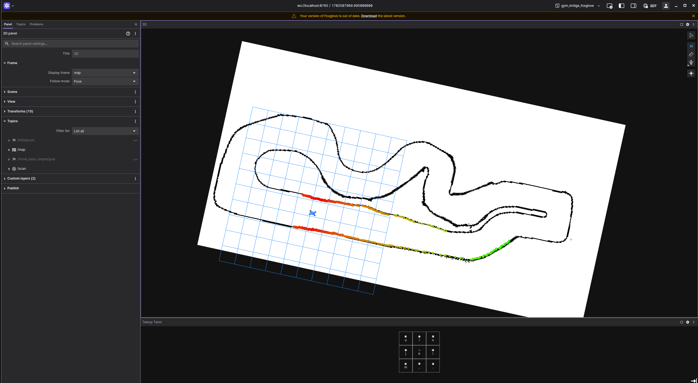

# F1TENTH gym environment ROS2 communication bridge

This is a containerized ROS communication bridge for the F1TENTH gym environment that turns it into a simulation in ROS2. This is a fork of [f1tenth_gym_ros](https://github.com/f1tenth/f1tenth_gym_ros/tree/dev-humble) on the `dev-humble` branch. The original README is found [here](./original.README.md)

## Prerequisites

The recommended setup is to use a Docker for containerization and Foxglove for visualization so those are the only prerequisites for running the simulation:
- [Docker](https://docs.docker.com/desktop/)
- [Foxglove Studio](https://foxglove.dev/download)

You can also run it natively if you want, for that see the [original README](./original.README.md)

## Usage

A github action automatically publishes a ready to use docker image. Here is the minimal docker-compose.yml file to use:
```
services:
  sim:
    image: ghcr.io/vaul-ulaval/f1tenth_gym_ros:latest
    entrypoint: bash -c "source /opt/ros/humble/setup.bash && source /sim_ws/install/local_setup.bash && ros2 launch f1tenth_gym_ros gym_bridge_launch.py"
    ports:
      - 8765:8765 # Foxglove
```

1. Copy the content above in a file called `docker-compose.yml`
2. Launch the simulation
```bash
docker compose pull && docker compose up
```
3. Open Foxglove Studio on `localhost:8765`
4. Install the `Teleop Twist (local)` [Foxglove extension](https://docs.foxglove.dev/docs/extensions)
5. Click on the `Teleop Twist (local)` at the bottom of the panel
6. You should be able to teleoperate the robot using `i` (forward), `j` (left), `k` (backward), `l` (right) and see its map and laser scan


